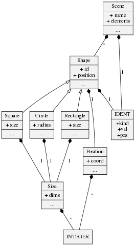

# Astrapi meta-compiler

## What is Astrapi ?

Astrapi is meta-compiler for Sexp-based Domain Specific Languages : once you have described your DSL concepts (abstract syntax) thanks to Astrapi language, the compiler generates several files for you:

* the corresponding classes
* lexer and parser
* generic visitor
* pretty printer
* graphical AST viewer

Finally a driver for you own DSL compiler is also generated. Version 0.0.8 provides Ruby generation, but Python, Java and C++ may be available soon.

Astrapi-generated DSL parser will assume your DSL models are written in plain **s-expressions**.

## What are s-expressions ?
S-expressions, abreviated as \"sexps\", actually mean \"symbolic expressions\". They originated from the famous LISP language. Compiler designers resort to  *sexp* as the most direct mean to capture Abstract Syntax Trees (AST) in a textual format.

Sexps are convenient to serialize both data *and* code, which offers a superiority over other serialization formats like XML, YAML or JSON.  

It may be noticed that several S-expressions parsers exist around. In the Ruby ecosystems, SXP and Sexpistols can be recommanded. However, these parsers will just turn the parenthesized expressions into a Ruby native data structure : namely arrays of arrays, etc. If your intent is to consider each s-expression as an instance of a *custom* class, then Astrapi is for you !

## How to install ?
In your terminal, simply type : **gem install astrapi**

## Quick start
In this example, we invent a toy language (DSL) that aims at describing simple geometry. Let us begin with examples programs written in our expected syntax :

```lisp
(scene test
  (square s1
     (position 123 345)
     (size 12)
  )
  (circle c1
     (position 123 345)
     (size 12 23)
  )
  (rectangle s2
     (position 323 445)
     (size 12 34)
  )
)
```

Now let\'s express the concepts of this model : let\'s name this a *metamodel*. I suffix this file with \'.mm\'. It ressembles *Ruby modules and class*, but it is not.
```Ruby
module Geometry

  class Scene
    attr name => IDENT
    attr elements => Shape[]
  end

  class Shape
    attr id => IDENT
    attr position => Position
  end

  class Square < Shape
    attr size => Size
  end

  class Circle < Shape
    attr radius => Size
  end

  class Rectangle < Shape
    attr size => Size
  end

  class Size
    attr dims => INTEGER[]
  end

  class Position
    attr coord => INTEGER[]
  end

end
```

Then compile this metamodel using Astrapi :

```console
jcll$ > astrapi geometry.mm
ASTRAPI meta-compiler for Sexp-based DSLs (c) J-C Le Lann 2016
==> parsing metamodel.................... geometry.mm
==> pretty print metamodel............... geometry_pp.mm
==> generate dot for metamodel........... geometry_ast.dot
==> checking metamodel
==> generating class diagram............. geometry_class_diagram.dot
==> generate software stack for DSL &#39;Geometry&#39;. Ruby version
-----> generating Geometry DSL AST classes
-----> generating Geometry DSL AST printer
-----> generating Geometry DSL lexer
-----> generating Geometry DSL parser
-----> generating Geometry DSL pretty printer
-----> generating Geometry DSL compiler
```

Now we can play with our brand new Geometry compiler !

```console
jcll$ > ruby geometry_compiler.rb ex1.geo
Geometry compiler
==> parsing ex1.geo
==> pretty print to ........ ex1.geo_pp.geometry
==> generate dot for AST in ex1.geo.dot
compiled in     : 0.001463371 s
```

In particular, we can have a look at the graphical AST (plain graphiz dot format). If you have xdot installed, simply type **xdot ex1.geo.dot** and the AST of our example will show up like this.


## About the Metamodel

### Basic syntax
Astrapi metamodel syntax remains very basic. A concept is captured as a **class**, followed by the list of its attributes **attr**. The type of the attributes appears after **=>**. Attributes can be simple or multiple. The order of declaration of classes has no importance, but the **order of *attr* declarations is fundamental**, as it drives the generated DSL parser. This may be enhanced in a future version.

### Basic data types
There also exist some basic types understood by Astrapi and parsed as *terminals* :

* **IDENT** will make the lexer recognize tokens matching the regexp /[a-zA-Z]+[a-zA-Z_0-9]*/i.
* **INTEGER** : regexp is /[0-9]+/
* **FLOAT** : regexp is /[0-9]+\.[0-9]+/
* **RANGE** : regexp is /[0-9]+..[0-9+/
* **STRING** : regexp is /\"(.*)\"/
* **NIL** : regexp is /nil/

Note that you can use **nil** in your DSL model, either for expected concepts or terminals.

### Graphical view of the Metamodel
A graphical view of the metamodel structure is also generated by Astrapi. This is a basic *class-diagram* of the AST classes. The name of the dot file appears during the metamodel compilation. It is suffix a ** xxx_ast.dot **.
To view it, type **xdot xxx_ast.dot**. For our Geometry example :



## Comments in Astrapi s-expressions
Comments are accepted in Astrapi s-expressions. Comments starts with **#** symbol and ends at the end of line. A comment will be attached (attribute **.comments_**) to the AST node following this comment. As such, comments can be reused (code generation etc).

## Credits
Please <a href="mailto:jean-christophe.le_lann@ensta-bretagne.fr">drop me an email</a> if you use Astrapi, or want some additional features or bug fixes.
